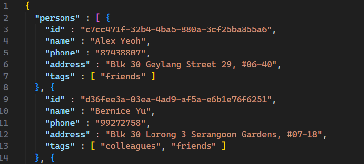
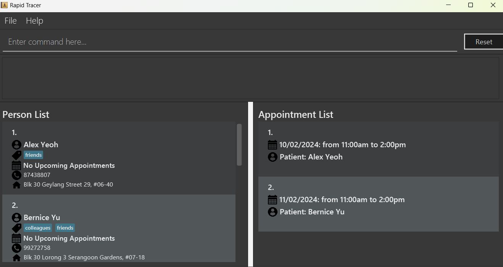
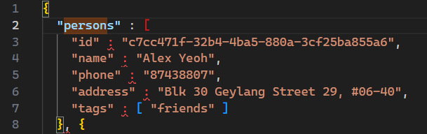
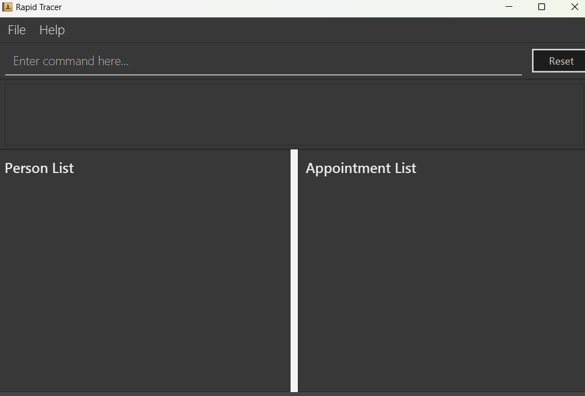
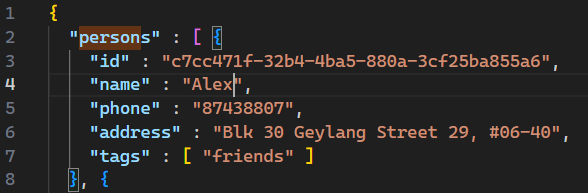

# Rapid Tracer Developer Guide

<!-- * Table of Contents -->
<page-nav-print />

--------------------------------------------------------------------------------------------------------------------

## **Acknowledgements**

This project was adapted from [AB3](https://se-education.org/addressbook-level3/), the source code of which can be found [here](https://github.com/nus-cs2103-AY2324S2/tp).

The OpenCSV library is used in `export` and `import` commands for features related to CSV files.
--------------------------------------------------------------------------------------------------------------------

## **Setting up, getting started**

Refer to the guide [_Setting up and getting started_](SettingUp.md).

--------------------------------------------------------------------------------------------------------------------

## **Design**

### Architecture

<puml src="diagrams/ArchitectureDiagram.puml" width="280" />

The ***Architecture Diagram*** given above explains the high-level design of the App.

Given below is a quick overview of main components and how they interact with each other.

**Main components of the architecture**

**`Main`** (consisting of classes [`Main`](https://github.com/AY2324S2-CS2103T-T10-2/tp/tree/master/src/main/java/seedu/address/Main.java) and [`MainApp`](https://github.com/AY2324S2-CS2103T-T10-2/tp/tree/master/src/main/java/seedu/address/MainApp.java)) is in charge of the app launch and shut down.
* At app launch, it initializes the other components in the correct sequence, and connects them up with each other.
* At shut down, it shuts down the other components and invokes cleanup methods where necessary.

The bulk of the app's work is done by the following four components:

* [**`UI`**](#ui-component): The UI of the App.
* [**`Logic`**](#logic-component): The command executor.
* [**`Model`**](#model-component): Holds the data of the App in memory.
* [**`Storage`**](#storage-component): Reads data from, and writes data to, the hard disk.

[**`Commons`**](#common-classes) represents a collection of classes used by multiple other components.

**How the architecture components interact with each other**

The *Sequence Diagram* below shows how the components interact with each other for the scenario where the user issues the command `delete 1`.

<puml src="diagrams/ArchitectureSequenceDiagram.puml" width="574" />

Each of the four main components (also shown in the diagram above),

* defines its *API* in an `interface` with the same name as the Component.
* implements its functionality using a concrete `{Component Name}Manager` class (which follows the corresponding API `interface` mentioned in the previous point.

For example, the `Logic` component defines its API in the `Logic.java` interface and implements its functionality using the `LogicManager.java` class which follows the `Logic` interface. Other components interact with a given component through its interface rather than the concrete class (reason: to prevent outside component's being coupled to the implementation of a component), as illustrated in the (partial) class diagram below.

<puml src="diagrams/ComponentManagers.puml" width="300" />

The sections below give more details of each component.

### UI component

The **API** of this component is specified in [`Ui.java`](https://github.com/AY2324S2-CS2103T-T10-2/tp/tree/master/src/main/java/seedu/address/ui/Ui.java)

<puml src="diagrams/UiClassDiagram.puml" alt="Structure of the UI Component"/>

The UI consists of a `MainWindow` that is made up of parts e.g.`CommandBox`, `ResultDisplay`, `PersonListPanel`, `StatusBarFooter` etc. All these, including the `MainWindow`, inherit from the abstract `UiPart` class which captures the commonalities between classes that represent parts of the visible GUI.

Namely, the `PersonListPanel` is responsible for displaying a list of cards with fields from (primarily) the `Person` model, and the `Appointment` model. Fields from `Appointment` are injected into the card. Likewise, the `AppointmentListPanel` is responsible for displaying a list of cards with data from both models.

The `UI` component uses the JavaFx UI framework. The layout of these UI parts are defined in matching `.fxml` files that are in the `src/main/resources/view` folder. For example, the layout of the [`MainWindow`](https://github.com/AY2324S2-CS2103T-T10-2/tp/tree/master/src/main/java/seedu/address/ui/MainWindow.java) is specified in [`MainWindow.fxml`](https://github.com/AY2324S2-CS2103T-T10-2/tp/tree/master/src/main/resources/view/MainWindow.fxml)

The `UI` component,

* executes user commands using the `Logic` component.
* listens for changes to `Model` data so that the UI can be updated with the modified data.
* keeps a reference to the `Logic` component, because the `UI` relies on the `Logic` to execute commands.
* depends on some classes in the `Model` component, as it displays `Person` and `Appointment` objects residing in the `Model`.

### Logic component

**API** : [`Logic.java`](https://github.com/AY2324S2-CS2103T-T10-2/tp/tree/master/src/main/java/seedu/address/logic/Logic.java)

Here's a (partial) class diagram of the `Logic` component:

<puml src="diagrams/LogicClassDiagram.puml" width="550"/>

The sequence diagram below illustrates the interactions within the `Logic` component, taking `execute("delete 1")` API call as an example.

<puml src="diagrams/DeleteSequenceDiagram.puml" alt="Interactions Inside the Logic Component for the `delete 1` Command" />

<box type="info" seamless>

**Note:** The lifeline for `DeletePersonCommandParser` should end at the destroy marker (X) but due to a limitation of PlantUML, the lifeline continues till the end of diagram.
</box>

How the `Logic` component works:

1. When `Logic` is called upon to execute a command, it is passed to an `AddressBookParser` object which in turn creates a parser that matches the command (e.g., `DeletePersonCommandParser`) and uses it to parse the command.
1. This results in a `Command` object (more precisely, an object of one of its subclasses e.g., `DeletePersonCommand`) which is executed by the `LogicManager`.
1. The command can communicate with the `Model` when it is executed (e.g. to delete a person). 
   Note that although this is shown as a single step in the diagram above (for simplicity), in the code it can take several interactions (between the command object and the `Model`) to achieve.
1. The result of the command execution is encapsulated as a `CommandResult` object which is returned back from `Logic`.

Here are the other classes in `Logic` (omitted from the class diagram above) that are used for parsing a user command:

<puml src="diagrams/ParserClasses.puml" width="600"/>

How the parsing works:
* When called upon to parse a user command, the `AddressBookParser` class creates an `XYZCommandParser` (`XYZ` is a placeholder for the specific command name e.g., `AddPersonCommandParser`) which uses the other classes shown above to parse the user command and create a `XYZCommand` object (e.g., `AddPersonCommand`) which the `AddressBookParser` returns back as a `Command` object.
* All `XYZCommandParser` classes (e.g., `AddPersonCommandParser`, `DeletePersonCommandParser`, ...) inherit from the `Parser` interface so that they can be treated similarly where possible e.g, during testing.

### Model component
**API** : [`Model.java`](https://github.com/AY2324S2-CS2103T-T10-2/tp/tree/master/src/main/java/seedu/address/model/Model.java)

<puml src="diagrams/ModelClassDiagram.puml" width="450" />

The `Model` component does the following:

* Stores the address book data:
  * All `Person` objects (which are contained in a `UniquePersonList` object).
  * All `Appointment` objects (which are contained in a `UniqueAppointmentList` object).
  * Both object types are encapsulated by the `AddressBook` object.
* Stores the currently 'selected' `Person` objects (e.g., results of a search query) as a separate _filtered_ list which is exposed to outsiders as an unmodifiable `ObservableList<Person>` that can be 'observed' e.g. the UI can be bound to this list so that the UI automatically updates when the data in the list change.
  * Likewise for the currently selected `Appointment` objects, they are observed through an unmodifiable `ObservableList<Appointment>`
* Stores a `UserPref` object that represents the user’s preferences. This is exposed to the outside as a `ReadOnlyUserPref` objects.
* Does not depend on any of the other three components (as the `Model` represents data entities of the domain, they should make sense on their own without depending on other components)

It is important to understand how the `Person` and `Appointment` objects function because they are coupled to each other through their `id`. A `Person` has a one-to-many relationship with `Appointment`. An `Appointment` object stores the `id` of its associated `Person` object. The mapping of `id` to `Person` is handled by the `AddressBook`.

<box type="info" seamless>

**Note:** An alternative (arguably, a more OOP) model is given below. It has a `Tag` list in the `AddressBook`, which `Person` references. This allows `AddressBook` to only require one `Tag` object per unique tag, instead of each `Person` needing their own `Tag` objects. 

<puml src="diagrams/BetterModelClassDiagram.puml" width="450" />

</box>

### Storage component

**API** : [`Storage.java`](https://github.com/AY2324S2-CS2103T-T10-2/tp/tree/master/src/main/java/seedu/address/storage/Storage.java)

<puml src="diagrams/StorageClassDiagram.puml" width="550" />

The `Storage` component,
* can save both address book data and user preference data in JSON format, and read them back into corresponding objects.
* inherits from both `AddressBookStorage` and `UserPrefStorage`, which means it can be treated as either one (if only the functionality of only one is needed).
* depends on some classes in the `Model` component (because the `Storage` component's job is to save/retrieve objects that belong to the `Model`)

### Common classes

Classes used by multiple components are in the `seedu.addressbook.commons` package.

--------------------------------------------------------------------------------------------------------------------

## **Implementation**

This section describes some noteworthy details on how certain features are implemented.

=======
### Add Appointment feature

#### Implementation

This features adds a new appointment to the system. The sequence diagram below illustrates the interactions inside the logic component when the `addappt 1 d/today 9am-2pm` command is entered by the user.

<puml src="diagrams/AddAppointmentSequenceDiagram.puml" alt="Interactions Inside the Logic Component for the `addappt 1 d/today 9am-2pm` Command" />

**Note:** The lifeline for `AddAppointmentCommandParser` should end at the destroy marker (X) but due to a limitation of PlantUML, the lifeline reaches the end of diagram.

Step 1. The user enters `addappt 1 d/today 9am-2pm` into the program. The user input is routed through the `:LogicManager` to the `:AddressBookParser`.

Step 2. The `:AddressBookParser` creates a new instance of `:AddAppointmentCommandParser` and calls `parse("1 d/today 9am-2pm")`.

Step 3. The call to `:AddAppointmentCommandParser#parse` utilizes two helper classes `ParserUtil` and `TimeParser` to parse the patient index and the appointment time respectively.

Step 4. The result of the `:AddAppointmentCommandParser#parse` function is a `:AddAppointmentCommand` object. This object is returned back to the `:LogicManager` which runs `:AddAppointmentCommand#execute`.

Step 5. This execution creates a new `Appointment` object and adds it the `:Model` via `addAppointment(appointmentToAdd)`.

Step 6. The result of the `:AddAppointmentCommand#execute` function is a `:CommandResult` object. This object contains directives for the UI for response handling.

#### Design Considerations

The creation of an `Appointment` requires a parent `Person` to be associated with it. In line with the Separation of Concerns (SoC) principle, the two objects are decoupled, and the `Appointment` object is associated with its `Person` solely through an identifier (id).

This design choice allows for reduced coupling between the objects, which simplifies both development and maintenance by minimizing the impact of changes in the `Person` object on the `Appointment` management system. Furthermore, it facilitates easier testing and enhances modularity, allowing each component to be developed, tested, and updated independently. This approach also improves scalability and performance, as the system uses lightweight references rather than direct object dependencies, which is particularly advantageous in this system where the entirety of our "database" is stored *in-memory*.

However, this decoupling necessitates careful handling of data consistency and synchronization, ensuring that changes in the `Person` data are accurately reflected in related `Appointments`, and vice-versa, to maintain system integrity. This is facilitated through the use of `Map<UUID, Person>` and `Map<UUID, Appointment>`, which serve as repositories for storing and retrieving person and appointment objects through their identifiers. Hence, enabling efficient CRUD operations for managing the lifecycles of each object within the system.

### Export feature

The `export` feature allows users to export the details of all patients stored to a CSV file. The CSV file is generated under `./data/PatientData.csv`.
The sequence diagram below shows how the `export` command goes through the `logic` component.

<puml src="diagrams/ExportSequenceDiagram.puml" width="550" />

Step 1: When the user issues the command `export`, Logic is called upon to execute the command, it is passed to the `AddressBookParser` object which creates an `ExportCommand` object directly.

Step 2: The `ExportCommandParser` class is not required in this case as the `export` command does not require any additional arguments from the user.

Step 3: The `execute` method call retrieves the file path of the `addressbook.json` by calling the getAddressBookFilePath() method in `Model`. This file contains information of all patients added into the system previously.

Step 4: The information in the JSON file retrieved is read by the `readJsonFile()` method in `ExportCommand` and returned as JSON trees.

Step 5: By calling the `readPerson()` method in `ExportCommand` on the JSON trees, the persons array is obtained.

Step 6: A csv file named `PatientData.csv` is created under the `data` directory by using the `createCsvDirectory()` method in `ExportCommand`.

Step 7: The CSV schema is built based on the fields of the persons array using the `createCsvSchema()` method in `ExportCommand`. This method relies on the Jaskson Dataformat CSV module to build the CSV schema.

Step 8: By calling the `writeToCsv`, the persons array is written to the CSV file according to the Schema created using Jackson's `CsvMapper`.

#### Design Considerations
The appointments associated with the patients stored in the address book is not exported to the csv file. This is intended as the `export` feature if expected to be executed only when the clinic wishes to transfer patient data to another clinic's system. As such, all the appointments associated with the patients will have to be rescheduled, rendering exporting previous associated appointments futile.

The patients added into the address book are each labeled with a unique ID, which will also not be exported as they are not required for identification of the patients outside the system. It would be more effective to identify them by name and phone instead.
### \[Proposed\] Undo/redo feature

#### Proposed Implementation

The proposed undo/redo mechanism is facilitated by `VersionedAddressBook`. It extends `AddressBook` with an undo/redo history, stored internally as an `addressBookStateList` and `currentStatePointer`. Additionally, it implements the following operations:

* `VersionedAddressBook#commit()` — Saves the current address book state in its history.
* `VersionedAddressBook#undo()` — Restores the previous address book state from its history.
* `VersionedAddressBook#redo()` — Restores a previously undone address book state from its history.

These operations are exposed in the `Model` interface as `Model#commitAddressBook()`, `Model#undoAddressBook()` and `Model#redoAddressBook()` respectively.

Given below is an example usage scenario and how the undo/redo mechanism behaves at each step.

Step 1. The user launches the application for the first time. The `VersionedAddressBook` will be initialized with the initial address book state, and the `currentStatePointer` pointing to that single address book state.

<puml src="diagrams/UndoRedoState0.puml" alt="UndoRedoState0" />

Step 2. The user executes `delete 5` command to delete the 5th patient in the address book. The `delete` command calls `Model#commitAddressBook()`, causing the modified state of the address book after the `delete 5` command executes to be saved in the `addressBookStateList`, and the `currentStatePointer` is shifted to the newly inserted address book state.

<puml src="diagrams/UndoRedoState1.puml" alt="UndoRedoState1" />

Step 3. The user executes `add n/David …​` to add a new patient. The `add` command also calls `Model#commitAddressBook()`, causing another modified address book state to be saved into the `addressBookStateList`.

<puml src="diagrams/UndoRedoState2.puml" alt="UndoRedoState2" />

<box type="info" seamless>

**Note:** If a command fails its execution, it will not call `Model#commitAddressBook()`, so the address book state will not be saved into the `addressBookStateList`.

</box>

Step 4. The user now decides that adding the patient was a mistake, and decides to undo that action by executing the `undo` command. The `undo` command will call `Model#undoAddressBook()`, which will shift the `currentStatePointer` once to the left, pointing it to the previous address book state, and restores the address book to that state.

<puml src="diagrams/UndoRedoState3.puml" alt="UndoRedoState3" />

<box type="info" seamless>

**Note:** If the `currentStatePointer` is at index 0, pointing to the initial AddressBook state, then there are no previous AddressBook states to restore. The `undo` command uses `Model#canUndoAddressBook()` to check if this is the case. If so, it will return an error to the user rather
than attempting to perform the undo.

</box>

The following sequence diagram shows how an undo operation goes through the `Logic` component:

<puml src="diagrams/UndoSequenceDiagram-Logic.puml" alt="UndoSequenceDiagram-Logic" />

<box type="info" seamless>

**Note:** The lifeline for `UndoCommand` should end at the destroy marker (X) but due to a limitation of PlantUML, the lifeline reaches the end of diagram.

</box>

Similarly, how an undo operation goes through the `Model` component is shown below:

<puml src="diagrams/UndoSequenceDiagram-Model.puml" alt="UndoSequenceDiagram-Model" />

The `redo` command does the opposite — it calls `Model#redoAddressBook()`, which shifts the `currentStatePointer` once to the right, pointing to the previously undone state, and restores the address book to that state.

<box type="info" seamless>

**Note:** If the `currentStatePointer` is at index `addressBookStateList.size() - 1`, pointing to the latest address book state, then there are no undone AddressBook states to restore. The `redo` command uses `Model#canRedoAddressBook()` to check if this is the case. If so, it will return an error to the user rather than attempting to perform the redo.

</box>

Step 5. The user then decides to execute the command `list`. Commands that do not modify the address book, such as `list`, will usually not call `Model#commitAddressBook()`, `Model#undoAddressBook()` or `Model#redoAddressBook()`. Thus, the `addressBookStateList` remains unchanged.

<puml src="diagrams/UndoRedoState4.puml" alt="UndoRedoState4" />

Step 6. The user executes `clear`, which calls `Model#commitAddressBook()`. Since the `currentStatePointer` is not pointing at the end of the `addressBookStateList`, all address book states after the `currentStatePointer` will be purged. Reason: It no longer makes sense to redo the `add n/David …​` command. This is the behavior that most modern desktop applications follow.

<puml src="diagrams/UndoRedoState5.puml" alt="UndoRedoState5" />

The following activity diagram summarizes what happens when a user executes a new command:

<puml src="diagrams/CommitActivityDiagram.puml" width="250" />

#### Design considerations:

**Aspect: How undo & redo executes:**

* **Alternative 1 (current choice):** Saves the entire address book.
  * Pros: Easy to implement.
  * Cons: May have performance issues in terms of memory usage.

* **Alternative 2:** Individual command knows how to undo/redo by
  itself.
  * Pros: Will use less memory (e.g. for `delete`, just save the patient being deleted).
  * Cons: We must ensure that the implementation of each individual command are correct.

--------------------------------------------------------------------------------------------------------------------

## **Documentation, logging, testing, configuration, dev-ops**

* [Documentation guide](Documentation.md)
* [Testing guide](Testing.md)
* [Logging guide](Logging.md)
* [Configuration guide](Configuration.md)
* [DevOps guide](DevOps.md)

--------------------------------------------------------------------------------------------------------------------

## **Appendix: Requirements**

### Product scope

**Target user profile**:

* A clinical counter clerk in charge of administrative tasks and contact tracing that involves both patients and staff.
* Very fast typer due to years of experience with excel sheets
* Tasked with managing large volumes of patient data, including contact histories, contact number, date of visit, across various settings.
* Responsible for swiftly identifying potential transmission chains to prevent outbreaks within the community.
* Requires an interface that allows for quick navigation and manipulation of datasets without relying on a mouse, favoring keyboard commands for efficiency.

**Value proposition**:

A simple and intuitive GUI with a keyboard-driven interface that mirrors the efficiency of Vim.

RapidTracer is a more user-friendly tool than Excel for managing large volumes of patient records and data; optimized patient care and outbreak management workflows designed to reduce administrative burdens. For healthcare professionals engaged in contact tracing, RapidTracer combines:

* Simple and intuitive GUI
* Quick to use for fast typers
* Instead of using Excel spreadsheets which tends to end up with too much redundant information (everything for everyone), and offers way too many features that a specific user like Dr Surya will not * use, RapidTracer is catered to Dr Surya’s context and field of work (everything for someone).
* Swiftly navigation through complex patient data and contact histories.
* A keyboard-driven interface that mirrors the efficiency of Vim
* The ability to load and store large datasets
* Optimized workflows designed to reduce administrative burdens, allowing healthcare professionals to concentrate on critical aspects of patient care and outbreak management.

### User stories

Priorities: High (must have) - `* * *`, Medium (nice to have) - `* *`, Low (unlikely to have) - `*`

| Priority | As a …​                                    | I want to …​           | So that I can…​                                                        |
|----------|--------------------------------------------|------------------------|------------------------------------------------------------------------|
| `* * *`  | new clinic clerk                                      | see usage instructions | refer to instructions when I forget how to use the App                 |
| `* * *`  | clinic clerk                                          | add a new patient       | keep track of clinical records                                               |
| `* * *`  | clinic clerk                                          | delete a patient        | remove entries that I no longer need                                   |
| `* * *`  | clinic clerk                                          | find a patient by name  | locate details of patient without having to go through the entire list |
| `* * *`  | clinic clerk                                          | update contact details | keep track of their current details                                    |
| `* * *`  | clinic clerk                               | create contacts for new patients | store their patient data |
| `* * *`  | clinic clerk                               | update existing patient contacts | keep track of their current information |
| `* * *`  | clinic clerk                               | delete patient contacts | abide by PDPA regulations |
| `* * *`  | clinic clerk                               | see the records of existing patient contacts | see their relevant information for administrative use |
| `* * *`  | clinic clerk                               | search my patient records | find a specific patient without scrolling through every single patient record |
| `* * *`  | clinic clerk                               | make an appointment for an existing contact | keep track of upcoming visits |
| `* * *`  | clinic clerk                               | update existing appointments | help my patients reschedule their appointments |
| `* * *`  | clinic clerk                               | delete upcoming appointments | help my patients reschedule their appointments |
| `* * *`  | clinic clerk                               | see the details of an appointment | maintain patient records |
| `* * *`  | clinic clerk                               | search my appointments | find a specific appointment without scrolling through every appointment |
| `* * *`  | clinic clerk                               | tag patients which have contracted infectious diseases such as COVID | keep track of their immunity period |
| `* * *`  | clinic clerk                               | see which patients have visited the clinic on the same day as each other | facilitate close contact tracing |
| `* *`    | clinic clerk                               | leave notes and remarks on patient contacts | take note of them for future appointments |
| `* *`    | clinic clerk                               | leave notes and remarks on appointment records | take note of important details for subsequent appointments |
| `* *`    | clinic clerk                               | navigate to an appointment record from a patient record | see the details of a specific appointment |
| `* *`    | clinic clerk                               | navigate to a patient contact from an appointment record | see the details of that specific patient |
| `* *`    | fast typer                                 | have an undo function (similar to "Ctrl + Z") | undo mistakes if I make a typo |
| `*`      | clinic clerk                               | have a calendar view of all my appointments | collect data on clinic popularity over time |
| `*`      | clinic clerk                               | download and save all my patient and appointment data | transfer my work to a new laptop |
| `*`      | clinic clerk                               | upload all my patient and appointment data | continue working when I switch to a new device |
| `*`      | clinic clerk with many patients in the address book | sort patient by name   | locate a patient easily                                                 |
| `*`      | normal guy just chilling                   | be able to click buttons | navigate the system even if I am not familiar with a CLI |

### Use cases

As Rapid Tracer is meant to be single-user, the System and Actor for all use cases will be RapidTracer and Clinic Clerk (Mr. Surya) respectively, unless otherwise specified.

#### General Use Cases

**Use Case: G01 - Exit System**

**MSS**
1. Actor requests to exit the System.
2. System saves current patient and appointment data to a file.
3. System exits.
4. Use case ends.

**Use Case: G02 - Display Help Message**

**MSS**
1. Actor requests to display a help message.
2. System displays a help message.
3. Use case ends.

#### Contact Use Cases

**Use Case: C01 - Add New Contact**

**MSS**
1. Actor enters the details required to make a new contact.
2. System saves the contact details and displays a confirmation message.
3. Use case ends.

**Extensions**
- 1a. System detects an error in the entered data.
    1. System displays a help message with the correct data entry format.
    2. System requests for new data.
    3. Actor enters new data.
    - Steps 1a1-1a3 are repeated until the data entered is correct.
    - Use case resumes from step 2.

**Use Case: C02 - Edit an Existing Contact**

**MSS**
1. Actor enters the details required to edit an existing contact.
2. System saves the updated contact details and displays a confirmation message.
3. Use case ends.

**Extensions**
- 1a. System detects an error in the entered data.
    1. System displays a help message with the correct data entry format.
    2. System requests for new data.
    3. Actor enters new data.
    - Steps 1a1-1a3 are repeated until the data entered is correct.
    - Use case resumes from step 2.

**Use Case: C03 - Find a Contact**

**MSS**
1. Actor requests to find a contact and enters the contact’s details.
2. System shows a list of contacts with matching details.
3. Use case ends.

**Extensions**
- 2a. The list is empty.
    - Use case ends.

**Use Case: C04 - Delete a Contact**

**MSS**
1. Actor requests to delete a specific patient in the list of contacts currently displayed.
2. System deletes the patient.
3. Use case ends.

**Extensions**
- 1a. The given index is invalid.
    1. System shows an error message.
    - Use case resumes at step 1.

**Use Case: C05 - List All Contacts**

**MSS**
1. Actor requests to list all contacts.
2. System lists all contacts.
3. Use case ends.

**Use Case: C06 - Conduct Contact Tracing**

**MSS**
1. Actor requests to list all contacts with appointments in a specific window of time.
2. System shows a list of contacts with matching details.
3. Use case ends.

**Extensions**
- 2a. The list is empty.
    - Use case ends.

#### Appointment Use Cases

**Use Case: A01 - Add Appointment**

**MSS:**
1. Actor enters appointment details for a patient visit.
2. System saves the appointment details.
3. Use case ends.

**Extensions**
- 1a. System detects an error in the entered data.
    1. System displays a help message with the correct data entry format.
    2. System requests for new data.
    3. Actor enters new data.
    - Steps 1a1-1a3 are repeated until the data entered is correct.
    - Use case resumes from step 2.

**Use Case: A02 - Edit an Appointment**

**MSS**
1. Actor enters the details required to edit an existing appointment.
2. System saves the updated appointment details and displays a confirmation message.
3. Use case ends.

**Extensions**
- 1a. System detects an error in the entered data.
    1. System displays a help message with the correct data entry format.
    2. System requests for new data.
    3. Actor enters new data.
    - Steps 1a1-1a3 are repeated until the data entered is correct.
    - Use case resumes from step 2.

**Use Case: A03 - Delete an Appointment**

**MSS**
1. Actor requests to delete a specific appointment in the list of appointments currently displayed.
2. System deletes the appointment.
3. Use case ends.

**Extensions**
- 1a. The given index is invalid.
    1. System shows an error message.
    - Use case resumes at step 1.

**Use Case: A04 - List All Appointments**

**MSS**
1. Actor requests to list all appointments.
2. System lists all contacts.
3. Use case ends.

**Extensions**
- 2a. The list is empty.
    - Use case ends.

**Use Case: A05 - Trace an Appointment**

**MSS**
1. Actor requests trace a specific appointment in the list of appointments currently displayed.
2. System lists all appointments and their contacts that are overlapping with the specific appointment.
3. Use case ends.

**Extensions**
- 1a. The given index is invalid.
    1. System shows an error message.
    - Use case resumes at step 1.

### Non-Functional Requirements

1. A user with above average typing speed for regular English text (i.e. not code, not system admin commands) should be able to accomplish most of the tasks faster using commands than using the mouse.
2. Should save backups of patient and appointment data at regular intervals (once every time the app is opened), in order to facilitate disaster recovery processes.
3. Should work on any *mainstream OS* as long as it has Java `11` or above installed. For Mac users, it should minimally work on any Mac which has been set up according to the advisory [here](https://nus-cs2103-ay2324s2.github.io/website/admin/programmingLanguages.html#programming-language).
4. Should be able to hold up to 1000 contacts without a noticeable sluggishness in performance for typical usage.
5. Should be able to hold up to 10000 appointments without a noticeable sluggishness in performance for typical usage.
6. Should have the ability to import patient and appointment data stored in common formats, such as CSV or JSON.
7. Should have comprehensive documentation for both users and developers in the form of a User and Developer Guide respectively.
8. Should respond to user commands within a reasonable timeframe( less than 1s)
9. Should be available during clinic operating hours with minimal downtime.
10. Should have mechanisms in place to prevent data loss or corruption, such as regular backups.
11. Should be able to recover from failures, minimizing downtime.

### Glossary

* **Mainstream OS**: Windows, Linux, Unix, MacOS
* **Private contact detail**: A contact detail that is not meant to be shared with others

--------------------------------------------------------------------------------------------------------------------

## **Appendix: Instructions for manual testing**

Given below are instructions to test the app manually.

<box type="info" seamless>

**Note:** These instructions only provide a starting point for testers to work on;
testers are expected to do more *exploratory* testing.

</box>

### Launch and shutdown

1. Initial launch

   1. Download the jar file and copy into an empty folder

   1. Double-click the jar file Expected: Shows the GUI with a set of sample contacts. The window size may not be optimum.

1. Saving window preferences

   1. Resize the window to an optimum size. Move the window to a different location. Close the window.

   1. Re-launch the app by double-clicking the jar file. 
       Expected: The most recent window size and location is retained.

### Deleting a patient

1. Deleting a patient while all patients are being shown

   1. Prerequisites: List all patients using the `list` command. Multiple patients in the list.

   1. Test case: `delete 1` 
      Expected: First contact is deleted from the list. Details of the deleted contact shown in the status message. Timestamp in the status bar is updated.

   1. Test case: `delete 0` 
      Expected: No patient is deleted. Error details shown in the status message. Status bar remains the same.

   1. Other incorrect delete commands to try: `delete`, `delete x`, `...` (where x is larger than the list size) 
      Expected: Similar to previous.

### Saving data

1. Dealing with missing/corrupted data files

   1. Prerequisites: Ensure that the `[JAR directory]/data/addressbook.json` file is generated by running the JAR file at least once, and closing it.

   2. Test case: Ensure the RapidTracer app is not running and the current `addressbook.json` file is valid and contains at least 1 patient.
   

        Expected: Opening the RapidTracer app will show a list of the current patients and appointments (if any).
    
     
    3. Test case: Make an invalid change to the `addressbook.json` file, by deleting the opening `{` of any patient.
    

        Expected: Opening the RapidTracer app will show 2 empty lists
    
     
    4. Test case: Make a valid change to the `addressbook.json` file, by changing name of any patient. E.g. "Alex Yeoh" -> "Alex".
    

        Expected: Opening the RapidTracer app will show the change.
    
