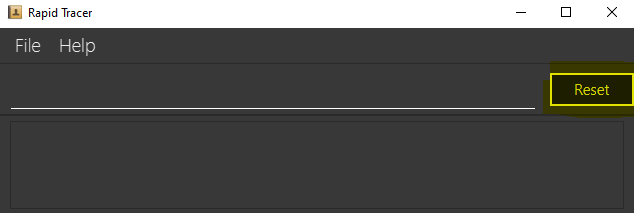
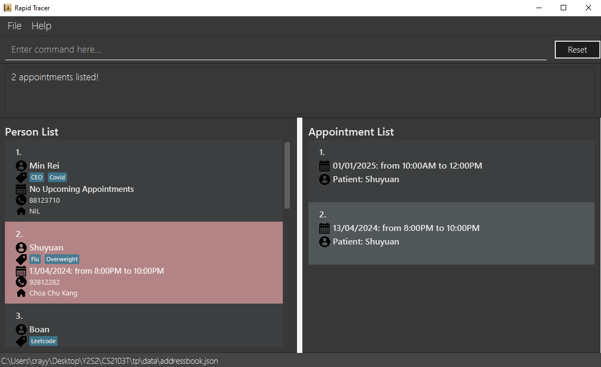
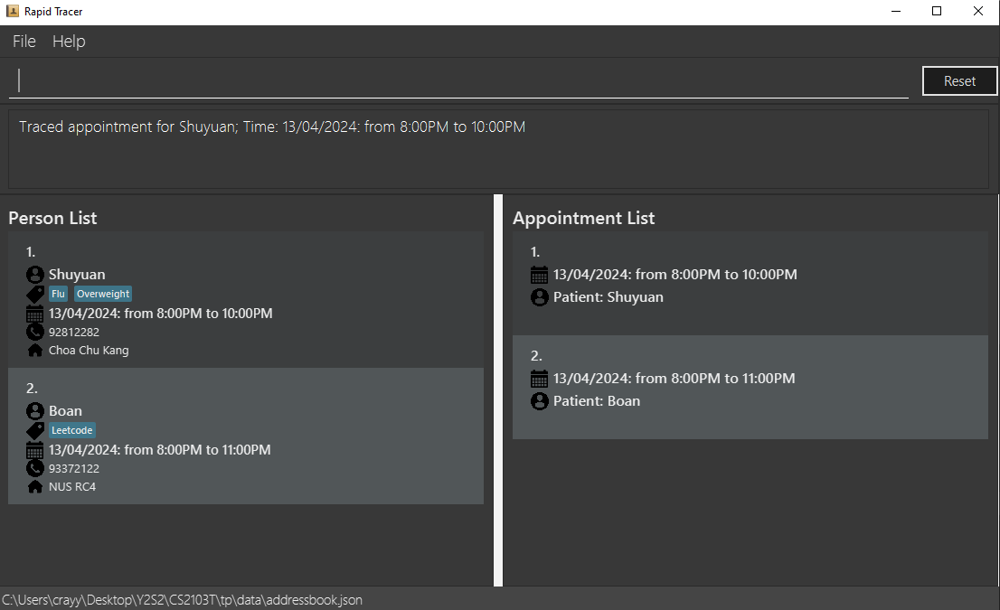
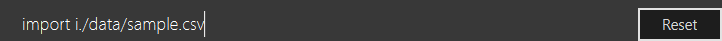
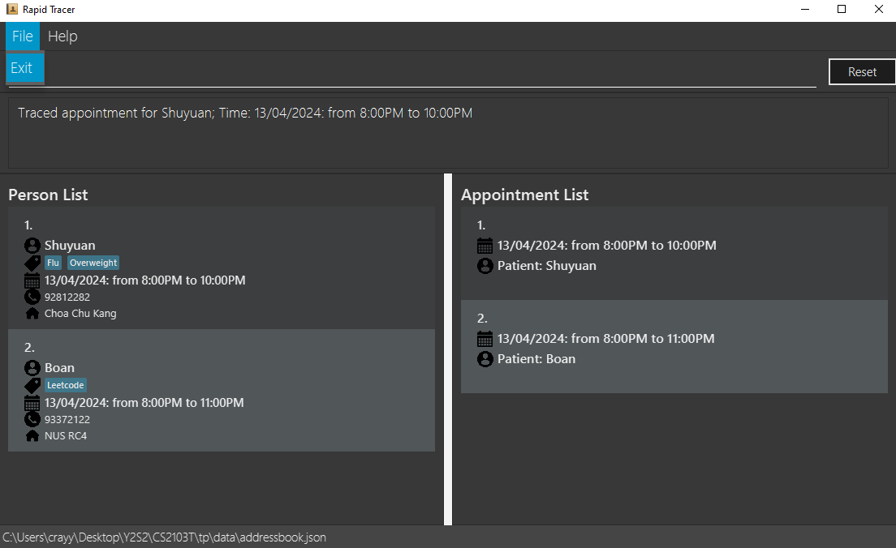

# RapidTracer

RapidTracer offers a fast-paced user interface (UI) for clinic managers to handle contacts and appointments. It combines:
- a simple and intuitive UI;
- swift navigation through complex patient data and contact histories;
- the ability to load and store large datasets; and is
- quick to use for fast typers!

This guide provides a walkthrough on how to use RapidTracer to assist you in your clinical workflows, starting from patient in-processing. For experienced users, click the links on the right for quick navigation!

<!-- * Table of Contents -->
<page-nav-print />

--------------------------------------------------------------------------------------------------------------------

## Quick start and installation

This section covers the download and installation process for RapidTracer.

1. Ensure you have Java `11` or above installed on your computer.
2. Download the latest version of `RapidTracer.jar` [here](https://github.com/AY2324S2-CS2103T-T10-2/tp/releases/tag/v1.2).
3. Copy the file to the folder you want to store all RapidTracer data in.
4. Open a command terminal and navigate to the folder where `RapidTracer.jar` is located using the `cd FOLDER_NAME` command. Use the `java -jar RapidTracer.jar` command to start running RapidTracer.
   

If you encounter any issues running RapidTracer, you may refer to the detailed bug fixing [here](https://nus-cs2103-ay2324s2.github.io/website/admin/programmingLanguages.html). Note that RapidTracer is intended to be used in fullscreen and some text may not show if the display window is re-sized to the minimum size.

--------------------------------------------------------------------------------------------------------------------

## Using RapidTracer

### Table of contents
1. [Input parameters](#inputs)
2. [Registering patients and appointments](#patient-in-processing)
3. [Searching existing records](#searching-records)
4. [Tracing close contacts](#trace)
5. [Editing and deleting records](#editing-records)
6. [Importing and exporting patient records](#import-export-data)
7. [General help](#general-help)

<h3 id="inputs" style="color: #088F8F">
  1. Input parameters
</h3>

The table below lists all input parameters and their possible values.
Parameter     | Max Length | Min Length | Remarks
-----------|-----------------------------------------|-----------------|----------|
`PATIENT_INDEX` | N.A. | 1 | Positive integer displayed at the top-left of a **patient** card.
`APPT_INDEX` | N.A. | 1 | Positive integer displayed at the top-left of an **appointment** card.
`KEYWORD`,  `MORE KEYWORDS` | N.A. | N.A. | Alphanumeric characters only.
`d/DATE_TIME` | N.A. | N.A. | Limited to between 6 Feb 1819 and 1 Jan 2101.  `DATE_TIME` format is `dd/MM/yyyy [x]am-[y]pm`. `dd/MM/yyyy` can be specified as `tdy` or `today` for today's date.
`n/NAME` | 50 |  1 | Alphanumeric characters only.
`p/PHONE_NUMBER` | 20 | 3 | Numeric characters only. No whitespace allowed between characters.
`a/ADDRESS` | 50 | 3 | Alphanumeric characters only.
`t/TAG` | 20 | 1 | Alphanumeric characters only. No whitespace allowed between characters.

<box type="info" seamless>
  <b>Remark:</b> Parameters that appear in square brackets (<code>[]</code>) subsequently are optional parameters.
</box>

<h3 id="patient-in-processing" style="color: #088F8F">
  2. Registering patients and appointments
</h3>

There are three ways you can register new patients and schedule new appointments.

<b>1.</b> Use the `add` command to register a new patient. 
<b>2.</b> Use the `addappt` command to schedule a new appointment for an existing patient. 
<b>3.</b> Use the `add` command to register a new patient and schedule an appointment immediately.

<h4 id="add" style="color: #7393B3">
  2.1. Use the <code>add</code> command to register a new patient
</h4>

You can add new patients to our database with the `add` command. Each patient must minimally have a name and a phone number for administrative purposes.

Format: `add n/NAME p/PHONE_NUMBER [a/ADDRESS] [t/TAG]`  
Example(s): `add n/Min Rei p/87654321`, `add n/Min Rei p/87654321 a/UTown`, `add n/Min Rei p/87654321 t/COVID`

- Parameters may be typed in any order.
- If you want to add multiple tags, please use multiple `[t/TAG]`.

<h4 id="addappt" style="color: #7393B3; margin-bottom: 0px">
  2.2. Use the <code>addappt</code> command to schedule a new appointment for an existing patient
</h4>
You can schedule appointments for existing patients using the `addappt` command.

Format: `addappt PATIENT_INDEX d/DATE_TIME`  
Example(s): `add 1 d/today 3pm-4pm`, `add 1 d/16/10/2024 3pm-4pm`

- Adds an appointment to the patient at the specified `PATIENT_INDEX`.
- Examples of accepted `DATE_TIME`:
  - `24/03/2024 10am-2pm`
  - `24/03/2024 10AM-2PM`
  - `24/03/2024 10am - 2pm`
  - `today 10am-2pm` (this will create an appointment from 10am to 2pm with today's date)
  - `tdy 10am-2pm` (this will create an appointment from 10am to 2pm with today's date)

<box type="info" seamless>
  <b>Remark:</b> The <code>addappt</code> command allows the addition of appointments with a passed date/time. This functionality allows you to add an appointment for record purposes if you forget to add the appointment when the patient visits the clinic. 
</box>

<h4 id="add-with-appt" style="color: #7393B3">
  2.3. Use the <code>add</code> command to register a new patient and schedule an appointment immediately
</h4>

For walk-in appointments, you can also create a new contact and add an appointment with a single command. This command automatically creates an appointment linked to the patient which is being added.

Format: `add n/NAME p/PHONE_NUMBER [a/ADDRESS] [t/TAG] [d/DATE_TIME]`  
Example(s): `add 1 n/Boyd Anderson p/87654321 d/tdy 11am-12pm`

<box type="info" seamless>
  <b>Remark:</b> This <code>add</code> command is the same as the one above, but with an extra field (the `DATE_TIME`).
</box>

- Parameters may be typed in any order.
- If you want to add multiple tags, please use multiple `t/`.
- Appointments cannot end on a different day from when they start.
- If you try to add multiple appointments by using multiple `d/` in one single `add` command, only the appointment with the last specified `DATE_TIME` will be registered.
- Examples of accepted `DATE_TIME`:
  - `24/03/2024 10am-2pm`
  - `24/03/2024 10AM-2PM`
  - `24/03/2024 10am - 2pm`
  - `today 10am-2pm` (this will create an appointment from 10am to 2pm with today's date)
  - `tdy 10am-2pm` (this will create an appointment from 10am to 2pm with today's date)

<h3 id="searching-records" style="color: #088F8F">
  3. Searching existing records
</h3>

RapidTracer offers search functions for both patient and appointment data. Beyond searching for specific patients and appointments, RapidTracer offers a list view to see all patient and appointment records. To reset the list view in both patient and appointment records, simply press the "Reset" button next to the search bar.

<h4 id="find" style="color: #7393B3">
  Searching for contacts: <code>find</code>
</h4>

Shows a list of contacts in RapidTracer matching the keywords provided. The contact only needs to partially match any of the keywords provided.

Format: `find KEYWORD [MORE_KEYWORDS]`

- The `KEYWORD` search is case-insensitive.
- Searches for the following patient information:
  - `NAME`
  - `PHONE_NUMBER`
  - `ADDRESS`

<h4 id="findappt" style="color: #7393B3">
  Finding appointment: <code>findappt</code>
</h4>

Shows a list of appointments in RapidTracer matching the keywords provided. The appointment only needs to partially match any of the keywords provided.

Format: `findappt KEYWORD [MORE_KEYWORDS]`

- The `KEYWORD` search is case-insensitive.
- Order of keywords does not matter.
- Searches for the following appointment information:
  - `NAME` of patient

Alternatively, simply double click any patient card to show the appointments associated with the patient.

<h4 id="list" style="color: #7393B3">
  Listing contacts: <code>list</code>
</h4>

Shows a list of all patients in RapidTracer.

Format: `list`

<h4 id="listappt" style="color: #7393B3">
  Listing appointments: <code>listappt</code>
</h4>

Shows a list of all appointments in RapidTracer.

Format: `listappt`

<h3 id="trace" style="color: #088F8F">
  4. Tracing close contacts
</h3>

Performs contact tracing on the selected appointment.
This shows a list of appointments that overlap with the selected appointment.
Any appointments that are within 5min before the start time and 5min after the end time are also considered overlapping.
This shows a list of patients that attended those appointments.

Format: `trace APPT_INDEX`

- Traces the appointment at the specified `APPT_INDEX`.

Alternatively, simply double click any appointment card to trace all close contacts.

<h3 id="editing-records" style="color: #088F8F">
  5. Editing and deleting records
</h3>

In the event that patients update their contact details or reschedule an appointment, their details can be updated accordingly. RapidTracer also allows you to cancel appointments and delete patient records.

<h4 id="edit" style="color: #7393B3">
  Editing contacts: <code>edit</code>
</h4>

An existing patient's details can be updated in RapidTracer using the `edit` command. Note that only patient details are changed. Their corresponding appointments will also be updated.

Format: `edit PATIENT_INDEX [n/NAME] [p/PHONE_NUMBER] [a/ADDRESS] [t/TAG]`  
Example(s): `edit 1 p/12345678`, `edit 1 a/NUS UTown`

- Edits the patient's details at the specified `PATIENT_INDEX`.
- Only one `PATIENT_INDEX` can be specified at a time.
- At least one of the optional fields must be provided.
- Existing values will be updated to input values.

<h4 id="editappt" style="color: #7393B3">
  Editing appointment: <code>editappt</code>
</h4>

An appointment can be rescheduled with the `editappt` command to change the date and time of the appointment.

Format: `editappt APPT_INDEX d/DATE_TIME` 
Example(s): `editappt 1 d/tdy 5pm-6pm`

- Edits the appointment's details at the specified `APPT_INDEX`.
- Only one `APPT_INDEX` can be specified at a time.
- Existing values will be updated to input values.
- The format of "DATE_TIME" is `dd/mm/yyyy [x]am-[y]pm`. Examples of accepted "DATE_TIME":
  - `24/03/2024 10am-2pm`
  - `24/03/2024 10AM-2PM`
  - `24/03/2024 10am - 2pm`
  - `today 10am-2pm` (this will create an appointment from 10am to 2pm with today's date)
  - `tdy 10am-2pm` (this will create an appointment from 10am to 2pm with today's date)

<h4 id="delete" style="color: #7393B3">
  Deleting patients: <code>delete</code>
</h4>

In the event that a patient requests for their data to be deleted, you can use the `delete` command to remove their patient information.

Format: `delete PATIENT_INDEX`

- Deletes the patient at the specified `PATIENT_INDEX`.
- Only one `PATIENT_INDEX` can be specified at a time.

<h4 id="deleteappt" style="color: #7393B3">
  Deleting appointments: <code>deleteappt</code>
</h4>

In the event that an appointment is cancelled, you can delete it using the `deleteappt` command.

Format: `deleteappt APPT_INDEX`

- Deletes the appointment at the specified `APPT_INDEX`.
- Only one `APPT_INDEX` can be specified at a time.

<h3 id="import-export-data" style="color: #088F8F">
    6. Importing and exporting patient records
</h3>

<h4 id="import" style="color: #7393B3">
  Importing patient records: <code>import</code>
</h4>

You can import patient data from a csv file.

Format: `import i/./data/FILENAME.csv`

- The csv file should be formatted in a way that it only contains 4 columns with specific headings as shown above.
- If you want to add multiple tags for the same person, please use ";" to separate the tags.
- Please save your patient data file under the `data` directory created when you launch RapidTracer in an empty file.
- Enter the command stated above with "FILENAME" replaced by the name of csv file you have, e.g. `import i/.data/sample.csv`:
  

<box type="info" seamless>
  <b>Remark:</b> You should avoid empty lines in the csv file you want to import.
Pre-existing patients (identified by similar names and phone numbers) in the records will not be imported again.
</box>

<h4 id="export" style="color: #7393B3">
  Exporting patient records: <code>export</code>
</h4>

You can export existing patient data to a csv file stored in a specific location.

Format: `export`

- Create a directory named `data` (if it doesn't exist) in the directory RapidTracer launched from.
- Create a new csv file named `PatientData.csv` in the `data` directory.
- The pre-existing data in the csv file will be overwritten once you perform the export action.

<box type="info" seamless>
  <b>Remark:</b> If you execute the export command without creating the data directory and PatientData.csv file, the directory and file will be automatically generated in the folder where RapidTracer is launched.
</box>

<h3 id="general-help" style="color: #088F8F">
  7. General help
</h3>

<h4 id="help" style="color: #7393B3">
  Viewing help: <code>help</code>
</h4>

For general help, click the `Help` option in the top left corner and click `Help` again, or type `help` to open the help window. The `help` window contains a link that directs [to this current User Guide](https://ay2324s2-cs2103t-t10-2.github.io/tp/UserGuide.html).

Format: `help`

<h4 id="exit" style="color: #7393B3">
  Exiting/closing RapidTracer: <code>exit</code>
</h4>

To properly exit RapidTracer, click the `File` option in the top left corner and click `Exit`, or type `exit`. This will ensure that the data is saved properly.

Format: `exit`

--------------------------------------------------------------------------------------------------------------------

## FAQ

**Q**: How do I upload records into RapidTracer? 
**A**: Use the `import` command!

**Q**: How do I download all my records from RapidTracer? 
**A**: Use the `export` command!

**Q**: A command is not working, what am I doing wrong? 
**A**: You can refer to the user guide above. If you're still having issues, please drop us an email at minrei.seah@u.nus.edu to let us know what's wrong.

**Q**: I still have an unanswered question! 
**A**: Please drop us an email at minrei.seah@u.nus.edu

--------------------------------------------------------------------------------------------------------------------

## Known issues

1. **When using multiple screens**, if you move the application to a secondary screen, and later switch to using only the primary screen, the app will open off-screen. The remedy is to delete the `preferences.json` file created by the application before running the application again.

2. **Overlapping appointments between different patients** is allowed currently because we are working with the assumption that there are multiple doctors at the clinic to attend to different patients.

3. **Reset button** currently does not remove the focus on Patient and Appointment cards.

--------------------------------------------------------------------------------------------------------------------

## Command summary

Action     | Format | Examples
-----------|-----------------------------------------|-----------------------------------------------------------------------------------------------------------------------------
Add patient | `add n/NAME p/PHONE_NUMBER [a/ADDRESS] [t/TAG] [d/DATE_TIME]` | `add n/Min Rei p/86615076`,  `add n/Min Rei p/86615076 a/UTown RC4 t/CEO`,  `add n/Min Rei p/86615076 d/27/03/2024 2pm-3pm`
Add appointment | `addappt PATIENT_INDEX d/DATE_TIME` | `addappt 1 d/27/03/2024 9am-10am`,  `addappt 1 d/today 9am-10am`,  `addappt 1 d/tdy 9am-10am`
Find patients | `find KEYWORD [MORE_KEYWORDS]` | `find Min Rei`,  `find rc4`
Find appointments | `findappt KEYWORD [MORE_KEYWORDS]` | `findappt Min Rei`
List all patients | `list` |
List all appointments | `listappt` |
Trace patients | `trace PATIENT_INDEX` | `trace 1`
Editing patient | `edit PATIENT_INDEX [n/NAME] [p/PHONE_NUMBER] [a/ADDRESS] [t/TAG]` | `edit 1 n/Seah Min Rei`
Editing appointment | `editappt APPPT_INDEX d/DATE_TIME` | `editappt 1 d/30/12/2024 8am-9am`
Import patient records | `import i/./data/FILENAME.csv` | `import i/.data/sample.csv`
Export patient records | `export` | 
Help | `help` |
Exit application | `exit` |
